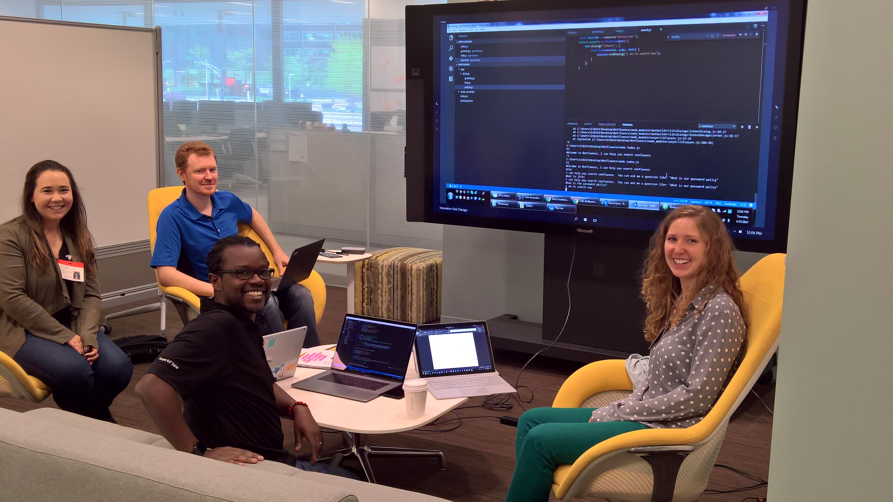
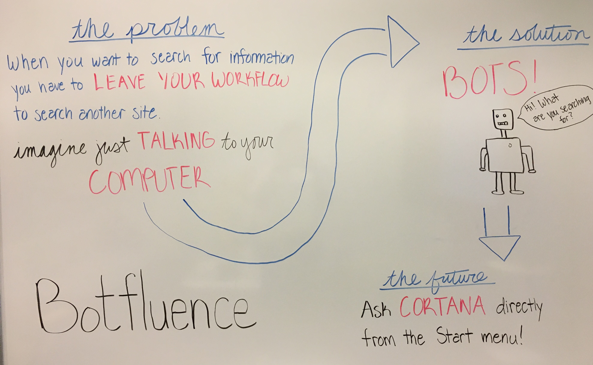
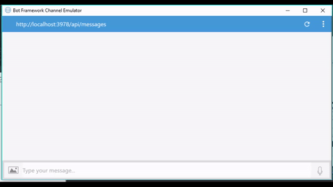
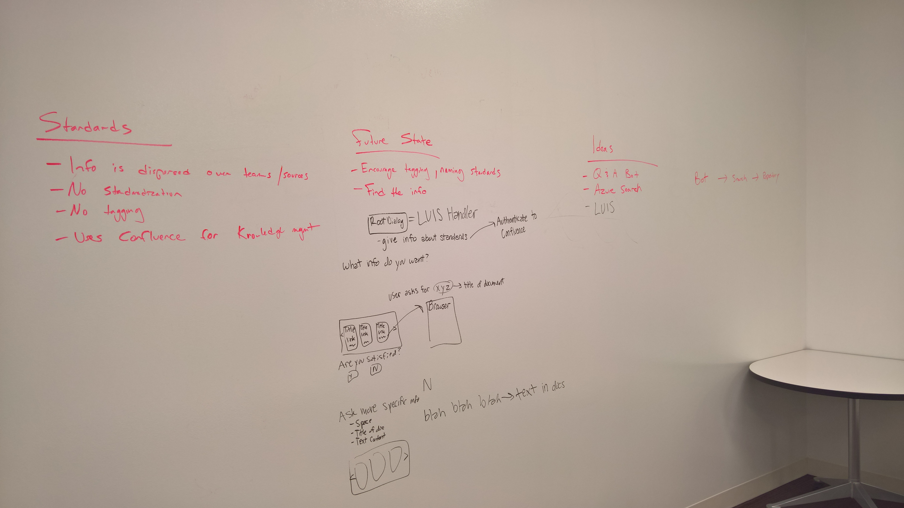
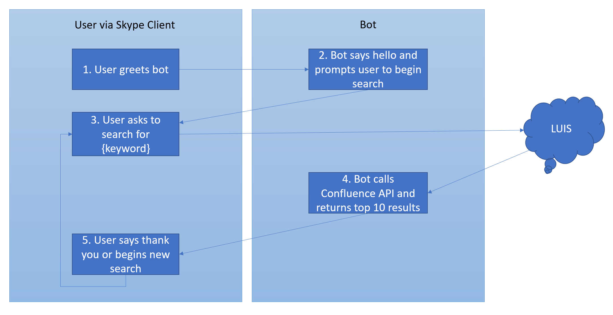
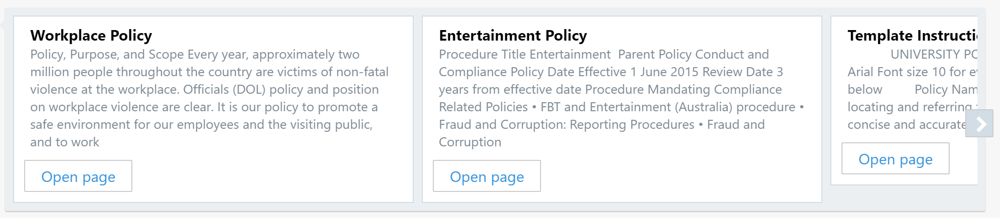
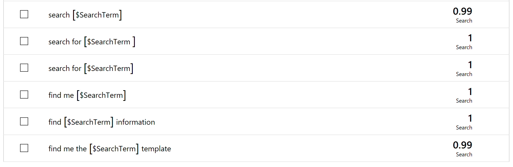

Chicago Mercantile Exchange Group and Microsoft joined forces to build a chat bot so users
can easily search their Confluence content management system's documentation and data. 

- Key Technologies
  - [Bot Framework](https://dev.botframework.com/)
  - [LUIS: Language Understanding Intelligent Service](https://www.luis.ai/)
  - [Confluence API](https://docs.atlassian.com/confluence/REST/latest/)

- Core Team 
  - Stephen McCarthy, Senior Software Engineer in Test at CME
  - [Justine Cocchi](https://twitter.com/justinecocchi), Technical Evangelist at Microsoft
  - [Kristin Ottofy](http://twitter.com/kristinottofy), Technical Evangelist at Microsoft
  - [Kevin M. Gates](https://twitter.com/kevinmgates), Principal Technical Evangelist at Microsoft



## Customer Profile ##

The [Chicago Mercantile Exchange Group](http://www.cmegroup.com/) is the world's leading and most diverse derivatives marketplace, handling 3 billion contracts worth approximately $1 quadrillion annually (on average). CME Group provides a marketplace for buyers and sellers, bringing together individuals, companies and institutions that need to manage risk or that want to profit by accepting risk.

CME's exchanges - CME, CBOT, NYMEX and COMEX - offer the widest range of global benchmark products across all major asset classes, including futures and options based on interest rates, equity indexes, foreign exchange, energy, agricultural commodities, metals, weather, and real estate. As part of their commitment to providing innovative risk-management solutions to the marketplace, CME Group also offers a growing slate of cleared OTC products and services. 

Through the CME Globex electronic trading platform, users worldwide can access the broadest array of the most liquid financial derivatives markets available anywhere. Additionally, CME Group operates CME Clearing, one of the world's leading central counterparty clearing providers. By serving as the counterparty to every trade that happens in their markets, they protect the integrity of their markets, virtually eliminating third-party credit risk. For the global economy, this unparalleled access translates into opportunity.

 
## Problem Statement ##

CME employees have strong security regulations because they handle sensitive data and intellectual property. 

CME Group developers are required to enforce many application standards such as password or content 
policies. Since there are far too many policies to memorize, CME developers often find themselves 
interrupting their workflow to search Confluence (CME Group's internal document store) for the proper 
policy. These interruptions and searches require context switching and result in an excessive amount 
of lost time. 

To help developers remain focused while searching for the proper policy, Microsoft and CME decided to 
develop a bot CME developers could access through an application used on a regular basis (such as Skype, 
one of the company's internal messaging systems) or through a Visual Studio plugin. Developers could 
search for the proper policy by simply asking the bot (within an application they were already using) 
to find it for them. 



## Customer Testimonial ##

<!--TODO: Add statement-->
 
## Solution and Steps ##

The project objective was to build a chat bot that integrates into a CME Group developer's existing 
workflow, making it easier to search for the documentation necessary to securing private information. 

<!--TODO: Insert solution image of bot in action -->


The initial brainstorming session concluded with a white board of ideas and possibilities for the bot.



To address CME Group's goals, we created a dialog flow solution to streamline the conversation between 
the user and the bot using the following architecture:

 

We took the following steps to create the overall solution:

1. Install [Visual Studio Code](https://code.visualstudio.com/)
2. Install [Node.js](https://nodejs.org/en/) and the [Bot Builder SDK for Node.js](https://docs.botframework.com/en-us/downloads/)
3. Install the [Bot Framework Emulator](https://docs.microsoft.com/en-us/bot-framework/debug-bots-emulator)
4. Setup the [Bot](https://docs.microsoft.com/en-us/bot-framework/nodejs/bot-builder-nodejs-overview) using a waterfall dialog method
5. Setup [LUIS](https://www.luis.ai/) and integrate in the bot application
6. Set up access to a [Confluence](https://www.atlassian.com/software/confluence) CMS and configure the REST API requests
7. Improve the conversational flow and retrain LUIS

## Technical Delivery ##

We built the core bot functionality by leveraging the [Bot Builder SDK for Node.js](https://docs.microsoft.com/en-us/bot-framework/resources-tools-downloads); this enabled a quick start in Visual Studio Code and a feature-rich environment for bot building. 

The bot uses the Knowledge Base Design Pattern with search functionality to return information from CME Group's Confluence CMS. Once the bot kicks off a search, it makes HTTP requests through the Confluence REST API; this returns results where the query matches the title of the articles and the part of the text inside each document. The results are then formatted and presented back to the user in a card carousel.

<!--TODO: Insert view of cards, maybe some code snippets-->


<!-- Need access to the code to fully flesh out this section -->
### Document Search Dialog ###

1. The user activates the bot with a greeting 
2. The bot says hello, prompts the user to search, and kicks off a dialog waterfall 
3. The bot waits for the user to ask for a resource 
4. The bot takes the user request and calls LUIS to parse the message 
5. Once LUIS parses the message information and the bot receives it, it enters the waterfall of dialogs. 

The actions included in the waterfall are:

- Default
    - Prompts user enter a search or ask for help
- Greeting
    - Says hi to the user and informs how to search with the bot
- Help
    - Displays information regarding how to interact with the bot
- Search
    - Takes a message or query and returns results after searching the Confluence content
- Closing
    - When a user says "thank you" or similar closing, the bot conversation ends

```js
var bot = new builder.UniversalBot(connector, function (session) {
    session.send('Sorry, I did not understand \'%s\'. Type \'help\' if you need assistance.', session.message.text);
});

bot.dialog('Search', [
    function (session, args, next) {
    ...EXTRACTED...
}
]).triggerAction({
    matches: 'Search',
    onInterrupted: function (session) {
        session.send('Sorry I did not understand or something happened. Please ask me to search for something or type \'help\' for assistance.');
    }
});

bot.dialog('Help', function (session) {
    session.endDialog('I\'m here to help! Try asking me things like \'search for password policy\' or \'find me the email templates\'');
}).triggerAction({
    matches: 'Help'
});

bot.dialog('Greeting', function (session) {
    session.endDialog('Hi! I can help you search Confluence. Try asking me things like \'search for password policy\' or \'find me the email templates\'');
}).triggerAction({
    matches: 'Greeting'
});

bot.dialog('Closing', function (session) {
    session.endDialog('Thank you for the chat! Have a great day!');
}).triggerAction({
    matches: 'Closing'
});
```

<!-- Need access to the code to fully flesh out this section -->
### Adding LUIS AI to Enhance Search ###
The [Language Understanding Intelligent Service (LUIS)](https://www.luis.ai/home/index) was 
used to parse the user input.

LUIS receives the user's intents and entities and parses them. The returned results guide 
the Confluence content search. 

The LUIS Intents created for this bot to reflect the bot dialog were:

- Greeting
    - Ex. "Hello", "Hi"
- Search
    - Ex. "Search", "Search for", "Find me", "Look for", or just the search term
- Help
    - "Help", "Please help"
- Closing
    - Ex. "Thank you", "Goodbye", "See ya"
- None

The LUIS entities created for this bot were:

- search term
    - Ex. "password policy", "html standards", "entertainment", "policy"

Below is a list of examples from LUIS of trained utterances in the Search Entity.



### Prerequisite Steps and Intial Roadblocks ###

There were several prerequisite steps and installations before we could begin working 
on this project, which are listed above. 

Installing Visual Studio Code and Node.js allowed us to start building our bot, but 
when it came time to test the bot for the first time we couldn't use the Bot Framework 
Channel Emulator. Because CME is a financial institution with a lot of protective 
regulations, employees can only download software available through their internal store. 
The Channel Emulator we needed to test our bot was not on that list of approved downloads. 
While we waited for a CME representative to approve the Channel Emulator so we could 
download it, we switched our bot to use the ConsoleConnector instead of the standard 
ChatConnecter. This allowed us to remain productive and test our conversation flow before 
adding in UI elements meant for rich channels. 

We were unable to access the LUIS API while connected to CME's internal network. Because 
natural language (and therefore LUIS), was essential to the bot's purpose, we needed to 
connect to CME's guest wireless network instead to develop and test our bot. This lead 
to yet another problem--all of the data we needed to access through CME's Confluence was
only available while we were on CME's internal network itself, not through the guest 
wireless network. This put us in a Catch-22 before we had even begun any real project 
development - do we use natural language (the core purpose of the bot), or do we use 
real data (the foundation of the bot's knowledge)? To overcome this roadblock, we set 
up a test Confluence site that looks like a micro version of CME's real Confluence site 
and used it to do our testing.


### Future Opportunities ###

Future business opportunities include:

- Expand the chat bot search offerings both to other employees in the organization and to all CMS data
- Expand bot accessibility (as a Q&A bot) to the external community 
- Expose the existing setup to canvases (such as Skype) or as a potential Visual Studio add-in
- Integrate Text-to-Speech and Speech-to-Text cognitive services to improve conversational interaction with the bot
 
Future technical opportunities include:

- Improving the authentication flow to allow any user to login to their Confluence account
- Retrain LUIS to better identify intents and entities
- Structure the dialog to use LUIS after the waterfall has begun (this known Bot Framework flaw is being addressed)

## Conclusion ##

CME Group can publish this bot to their preferred channels (such as Skype or Slack) so all 
developers can use the application. 

With this bot, CME Group can extend the solution to all their employees to increase 
productivity across the entire organization. 

Additional goals include cognitive services to improve the conversational flow such as 
converting speech to text and text to speech. The bot’s abilities to identify the user's 
intent and the search term will get better as LUIS gathers more data and is retrained.

Because of this project, CME Group has many of the tools approved for building future 
projects with the Bot Framework and a setup for operating with the internal network such 
as the Bot Framework and Guest Wifi. Once this bot is approved by the security team and is 
placed in production, CME Group developers and users will have the opportunity to create 
and explore the possibilities of enabling all customers and employees with bots to 
increase productivity everywhere.

## Additional resources ##

- [LUIS documentation](https://www.luis.ai/)
- [Bot Framework](https://dev.botframework.com/)
- [Confluence content collaboration software](https://www.atlassian.com/software/confluence)