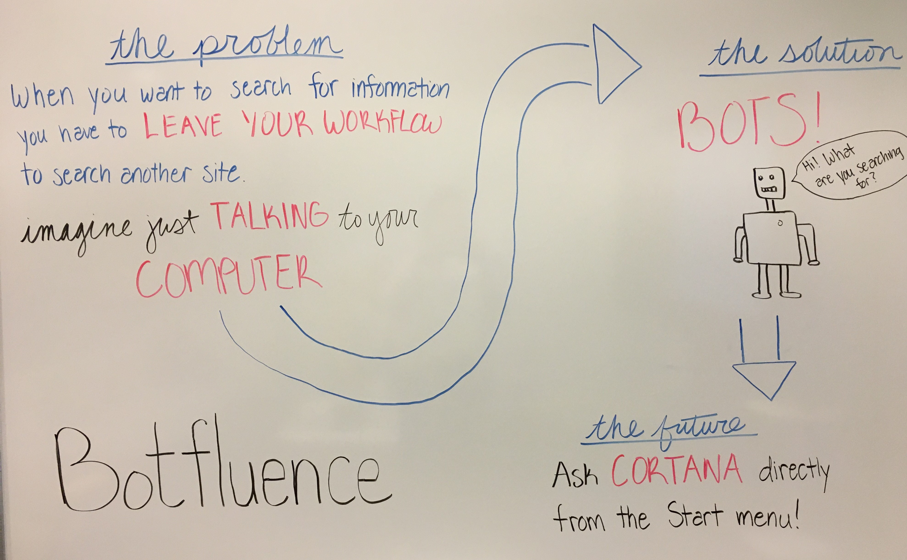

Chicago Mercantile Exchange Group and Microsoft joined forces to build a chat bot to enable users access to more convienent searching capabilities of the documentation and data stored in their Confluence content management system. 

- Key Technologies
  - [Bot Framework](https://dev.botframework.com/)
  - [LUIS: Language Understanding Intelligent Service](https://www.luis.ai/)
  - [Confluence API](https://docs.atlassian.com/confluence/REST/latest/)

- Core Team 
  - Stephen McCarthy, Senior Software Engineer in Test at CME
  - [Justine Cocchi](https://twitter.com/justinecocchi), Technical Evangelist at Microsoft
  - [Kristin Ottofy](http://twitter.com/kristinottofy), Technical Evangelist at Microsoft
  - [Kevin M. Gates](https://twitter.com/kevinmgates), Principal Technical Evangelist at Microsoft

## Customer Profile ##

The [Chicago Mercantile Exchange Group](http://www.cmegroup.com/) is the world's leading and most diverse derivatives marketplace, handling 3 billion contracts worth approximately $1 quadrillion annually (on average). CME Group provides a marketplace for buyers and sellers, bringing together individuals, companies and institutions that need to manage risk or that want to profit by accepting risk.

CME's exchanges - CME, CBOT, NYMEX and COMEX - offer the widest range of global benchmark products across all major asset classes, including futures and options based on interest rates, equity indexes, foreign exchange, energy, agricultural commodities, metals, weather, and real estate. As part of their commitment to providing innovative risk-management solutions to the marketplace, CME Group also offers a growing slate of cleared OTC products and services. 

Through the CME Globex electronic trading platform, users worldwide can access the broadest array of the most liquid financial derivatives markets available anywhere. Additionally, CME Group operates CME Clearing, one of the world's leading central counterparty clearing providers. By serving as the counterparty to every trade that happens in their markets, they protect the integrity of their markets, virtually eliminating third-party credit risk. For the global economy, this unparalleled access translates into opportunity.

 
## Problem Statement ##

As employees for an institution with strong security regulations due to the handling of sensitive data and intellectual property, CME Group developers enforce many standards in their applications such as password or content policies. Because there are far too many to memorize, CME developers often find themselves interrupting their workflow to search Confluence, CME Group's internal document store, for the proper policy. This results in a loss of time due to context switching. 

A bot accessible through an application used on a regular basis such as Skype, one of the company's internal messaging systems, or through a Visual Studio plugin would help the developers to remain focused while searching for the proper policy by simply asking the bot to find it for them within the applications already in use.

## Customer Testimonial ##

<!--TODO: Add statement-->
 
## Solution and Steps ##

The objective of the project was to build a chat bot that integrates into a CME Group developer's existing workflow, making it easier to search for the documentation necessary to securing private information. 

<!--TODO: Insert solution image of bot in action -->

The initial brainstorming session concluded with a white board of ideas and possibilities for the bot.

To address CME Group's goals, the dialog flow solution was created to streamline the conversation between the user and the bot with the following architecture.

 

The following steps were taken to create the overall solution:
1. Install [Visual Studio Code](https://code.visualstudio.com/)
2. Install [Node.js](https://nodejs.org/en/) and the [Bot Builder SDK for Node.js](https://docs.botframework.com/en-us/downloads/)
3. Install the [Bot Framework Emulator](https://docs.microsoft.com/en-us/bot-framework/debug-bots-emulator)
4. Setup the [Bot](https://docs.microsoft.com/en-us/bot-framework/nodejs/bot-builder-nodejs-overview) using a waterfall dialog method
5. Setup [LUIS](https://www.luis.ai/) and integrate in the bot application
6. Set up access to a [Confluence](https://www.atlassian.com/software/confluence) CMS and configure the REST API requests
7. Improve the conversational flow and retrain LUIS

Future Opportunities include:
- Expand the search offerings of the chat bot to other employees in the organization to all data within the CMS
- Allow accessibility of the bot to the external community as a Q&A bot
- Expose the existing setup to canvases such as Skype or potentially Visual Studio add-in
- Integrate Text-to-Speech and Speech-to-Text cognitive services to improve conversational interaction with the bot

## Technical Delivery ##

The core bot functionality was built by leveraging the [Bot Builder SDK for Node.js](https://docs.microsoft.com/en-us/bot-framework/resources-tools-downloads), which enabled a quick start in Visual Studio Code and a feature-rich environment for building the bot. The bot uses the Knowledge Base Design Pattern with search functionality to return information from CME Group's Confluence CMS. Once the bot kicks off a search, it makes HTTP requests through the Confluence REST API which returns results where the query matches the title of the articles and the part of the text inside each document. The results are then formatted and presented back to the user in a carousel of cards.

<!--TODO: Insert view of cards, maybe some code snippets-->

<!-- Need acess to the code to fully flesh out this section -->
### Document Search Dialog ###
The user can activate the bot with a greeting. The bot says hello, pompts the user to search, and kicks off a waterfall of dialogs. It expects the user to ask for a resource in which it makes a call to LUIS to parse the message. Once the bot has it's information returned from LUIS, it enters the waterfall. 

The actions included in the waterfall are:
- root or default (/)
  - prompts user enter a search or ask for help
- help
  - displays information regarding how to interact with the bot
- search
  - takes a message or query and returns results
- end
  - when a user says "thank you" or similar closing, the bot conversation ends

<!--TODO: Insert code snippet or image for dialog -->

<!-- Need acess to the code to fully flesh out this section -->
### Adding LUIS Entities to Enhance Search ###
The [Language Understanding Intelligent Service (LUIS)](https://www.luis.ai/home/index) was used to parse any intents and entities the user entered to guide the search of the Confluence content. 

The intents created for this bot were:
- Greeting
- Search
- Help
- Closing
- None

The entities created for this bot were:
- search term

<!--TODO: Insert code snippet or image for LUIS -->

 ### Prerequisite Steps and Intial Roadblocks ###

There were several prerequiste steps and installations before we could begin working on this project, which are listed above. Installing Visual Studio Code and Node.js allowed us to start building our bot, however when it came time to test the bot for the first time we couldn't use the Bot Framework Channel Emulator. Because CME is a financial institution with a lot of protective regulations, employees can only download software available through their internal store. The Channel Emulator we needed to test our bot was not on that list of approved downloads. While we waited for a representative from CME to approve the Channel Emulator as an approved download, we switched our bot to use the ConsoleConnector instead of the standard ChatConnecter. This allowed us to remain productive and test our conversation flow before adding in UI elements meant for rich channels. 

The second intial problem we ran into was not being able to access the LUIS API while connected to CME's internal network. Because natural language, and therefore LUIS, were essential to the purpose of our bot, we needed to connect to CME's guest wifi instead to develop and test our bot. This lead to yet another problem because all of the data we needed to access through CME's Confluence was only avaialbe while we were on CME's internal network itself, not through the guest wifi. This put us in a Catch 22 before we had even begun any real development of this project- do we use natural language, the core purpose of the bot, or do we use real data, the foundation of the bot's knowledge. To overcome this roadblock, we set up a test Confluence site that looks like a micro version of CME's real Confluence site to do our testing.

## Conclusion ##

This section will briefly summarize the technical story with the following details included:

- Measurable impact/benefits resulting from the implementation of the solution.
- General lessons:
  - Insights the team came away with
  - What can be applied or reused for other environments or customers?
- Opportunities going forward:
  - Details on how the customer plans to proceed or what more they hope to accomplish

*If you’d really like to make your write-up pop, include a customer quote highlighting impact, benefits, general lessons, and/or opportunities.*

<!--TODO: Update Conclusion section-->

## Additional resources ##
In this section, include a list of links to resources that complement your story, including (but not limited to) the following:

- Documentation
- Blog posts
- GitHub repos
- Etc…

<!--TODO: Update additional resource-->
- [Document Search Dialog](#document-search-dialog)
- [Adding LUIS Entities to Enhance Search](#adding-luis-entities-to-enchance-search)